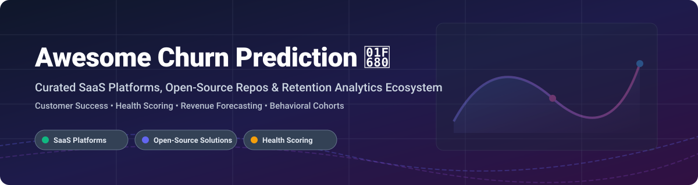

# Awesome Churn Prediction 🚀

  
  
  
  

## 📌 Top Churn Prediction & Customer Retention Platforms Ecosystem 📊

**A Curated List of Enterprise SaaS Products, Analytics Tools & Open-Source GitHub Projects**

*Focused on Customer Health Scoring 🎯, Retention Automation 🤖, Revenue Forecasting 📈, Behavioral Analytics & Proactive Account Engagement*

---

## 💡 Industry Overview & Market Intelligence 🌐

> **Market Size & Structure**: The global Customer Success and Churn Prediction Software market size is estimated at **$1.8 Billion to $2.2 Billion**, projecting growth at a CAGR of **18.5%** toward **$5.5+ Billion**. 
> 
> **Market Dynamics**: The market is **moderately fragmented**, bridging enterprise-grade Customer Success Platforms (CSPs like Gainsight and ChurnZero) and product analytics tools (like Amplitude and PostHog). While market leaders capture high enterprise spend, specialized e-commerce churn engines, warehouse-first CDPs, and open-source models maintain strong market share, preventing a "winner-take-all" concentration.

---

## 📑 Table of Contents

- [☁️ SaaS / Hosted Platforms](#-saas--hosted-platforms)
- [🔓 Open-Source GitHub Projects](#-open-source-github-projects)
- [🤝 How to Contribute](#-how-to-contribute)
- [💖 Support & Community](#-support--community)
- [📈 Star History](#-star-history)
- [⚠️ Disclaimer](#%EF%B8%8F-disclaimer)

---

## ☁️ SaaS / Hosted Platforms

The table below summarizes leading commercial platforms for customer churn prediction, health scoring, and customer success management, sorted by **Estimated Scale / Market Cap (Descending)**:

| Platform | Key Focus & Features | Starting Tier Price 💳 | Free Tier / Trial Limit ⏳ | Est. Scale / Valuation / Market Cap 🏢 |
| :--- | :--- | :--- | :--- | :--- |
| **[Amplitude](https://amplitude.com/)** | Product analytics with AI churn prediction & behavioral cohort tracking | $0/mo (Starter/Plus volume model) | **Free Forever**: 2 Million events/month limit | **~$1.65 Billion** (Public: NASDAQ `AMPL`) |
| **[Gainsight](https://www.gainsight.com/)** | Enterprise CS standard: 360° views, health scores, journey orchestration | ~$14,000/year (Essentials tier estimate) | **No Free Tier / No Self-Serve Trial** (Guided sales demo only) | **~$1.1 Billion** (Acquired by Vista Equity) / ~$300M ARR |
| **[Optimove](https://www.optimove.com/)** | AI-powered churn prediction & customer-led marketing orchestration | ~$48,000/year (Custom enterprise tier) | **No Free Tier / No Self-Serve Trial** (Custom proof-of-concept) | **~$79.2 Million** ARR |
| **[ChurnZero](https://churnzero.com/)** | Real-time usage tracking, automated success plays & churn alerts | ~$12,000/year (Base account tier) | **No Free Tier / No Self-Serve Trial** (Sales demo sandbox available) | **~$60.0 Million** ARR |
| **[Catalyst](https://catalyst.io/)** | Data-driven CS management, account health scoring & revenue forecasting | ~$20,000/year (Growth tier estimate) | **No Free Tier / No Self-Serve Trial** (Sales-guided demo) | **~$44.2 Million** ARR / $100M+ Valuation |
| **[Planhat](https://www.planhat.com/)** | Flexible customer data platform combining CS, sales & product metrics | ~$30,000/year (Base platform contract) | **No Free Tier / No Self-Serve Trial** (Custom implementation) | **~$33.0 Million** ARR |
| **[Vitally](https://www.vitally.io/)** | Developer-friendly CS platform with collaborative docs & flexible APIs | ~$300/mo ($3,600/year base platform) | **No Free Tier / 14-Day Sales Sandbox Trial** | **~$25.0 Million** ARR |
| **[Velaris](https://www.velaris.io/)** | AI-driven CS platform with health scoring & automated retention plays | ~$9,000/year (Starter organization plan) | **No Free Tier / 14-Day Guided Trial** | **~$11.2 Million** ARR |
| **[Totango](https://www.totango.com/)** | Modular CS architecture with success plays & customer journey design | ~$15,000/year (Composable CS plan) | **No Free Tier / 30-Day Enterprise Trial** | **Private** (Acquired by SAP in 2024) |
| **[Custify](https://www.custify.com/)** | SMB & mid-market CS platform with automated tasks & health alerts | ~$600/month (~$7,200/year starter) | **No Free Tier / 14-Day Sales Demo Trial** | **Private** (Growing SMB Market) |

---

## 🔓 Open-Source GitHub Projects

Below are top open-source projects for self-hosted customer churn prediction, CRM foundations, warehouse-first analytics, and sentiment tracking. Ranked by **GitHub Star Count (Descending)**:

- **[Odoo](https://github.com/odoo/odoo)**   
  **Enterprise ERP & CRM platform.** Offers customizable customer tracking, predictive sales pipeline analysis, and churn prevention modules for fully self-hosted organizations. **LGPL-3.0**.

- **[PostHog](https://github.com/PostHog/posthog)**   
  **Open-source product analytics suite.** Self-hosted alternative to Amplitude and Mixpanel with session recording, feature flags, cohort analysis, and retention funnels. **MIT**.

- **[SuiteCRM](https://github.com/salesagility/SuiteCRM)**   
  **The enterprise open-source CRM.** Fully customizable to build Gainsight-style 360-degree customer health scoring and churn risk management workflows without license fees. **AGPL-3.0**.

- **[Twenty](https://github.com/twentyhq/twenty)**   
  **Modern open-source CRM built as a Salesforce alternative.** Features a highly extensible data model ideal for building custom Customer Success metrics and account retention tracking. **AGPL-3.0**.

- **[RudderStack Open Source](https://github.com/rudderlabs/rudder-server)**   
  **Warehouse-first customer data platform (CDP).** Collects and routes customer behavioral data directly into your data warehouse for building custom ML churn prediction pipelines. **SSPL**.

- **[Helio](https://github.com/achref-soua/helio)**   
  **Open-source CDP & journey orchestration engine.** High-throughput (~20,000 events/s) growth platform built with PostgreSQL and ClickHouse for automated customer retention campaigns. **Open Source**.

- **[ChurnPilot](https://github.com/sehidesena/ChurnPilot)**   
  **Agentic AI churn prediction engine.** Automated ML platform tailored for e-commerce and SaaS customer retention using recency, frequency, and custom feature scoring. **Open Source**.

- **[CRMlytics](https://wordpress.org/plugins/crmlytics/)**  
  **WooCommerce-native predictive CRM.** Features local machine learning churn risk identification, customer health scoring (0-100 scale), RFM matrices, and targeted email campaigns without third-party API dependencies. **GPLv2**.

- **[Customer Intelligence for WooCommerce](https://wordpress.org/plugins/customer-intelligence-for-woocommerce/)**  
  **WooCommerce churn prediction & analytics plugin.** Provides RFM segmentation matrices, Customer Lifetime Value (CLV) predictions, and cohort retention heatmaps directly on WordPress. **GPLv2**.

- **[Sentiment Evolution Tracker (MCP)](https://huggingface.co/spaces/MCP-1st-Birthday/mcp-nlp-analytics)**  
  **Model Context Protocol (MCP) server for LLM churn scoring.** Enables Claude and other AI models to evaluate real-time sentiment evolution, detect customer risk signals, and query persistent SQLite customer logs. **Open Source**.

---

## 🛠️ Frameworks for Custom Churn Infrastructure 🏗️

For engineering teams looking to build a custom retention stack:
1. **CDP & Data Ingestion**: Use **RudderStack** or **Helio** for event streams.
2. **Product & Cohort Analytics**: Deploy **PostHog** for behavioral retention tracking.
3. **CRM & Account Management**: Use **Twenty** or **SuiteCRM** for core account data.
4. **Predictive Analytics & AI**: Integrate **ChurnPilot** or **Sentiment Evolution Tracker** for ML scoring.

---

## 🤝 How to Contribute

Contributions to expand this list are always welcome! ✨

1. **Fork** the repository. 🍴
2. **Add/Edit** entries in `README.md` following the table or list format. ✏️
3. Ensure description includes key features, pricing/license information, and official links. 🔗
4. Submit a **Pull Request** with a clear explanation of additions. 🚀

---

## 💖 Support & Community

If you find this repository helpful, please consider starring ⭐, forking 🍴, or sharing it with your network!

Your support helps maintain and update open-source developer tools and curated resources. Thank you! 🙌

---

## 📈 Star History

---

## ⚠️ Disclaimer

- This list is **community-curated** for educational and research purposes.
- Churn prediction tools process sensitive user data; ensure full compliance with **GDPR**, **CCPA**, and enterprise data security policies.
- Commercial details (pricing, ARR, valuations) reflect best available estimates as of late 2026 and are subject to vendor updates.
